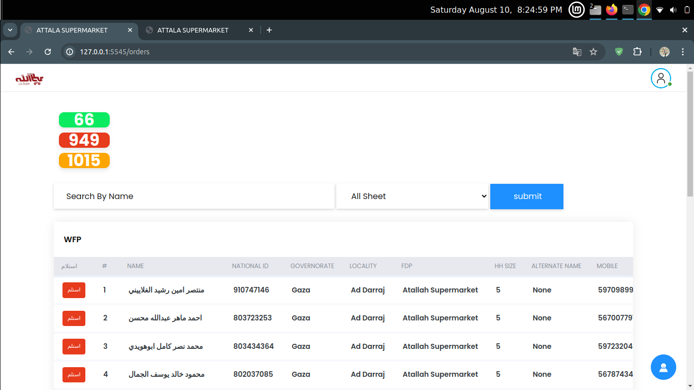
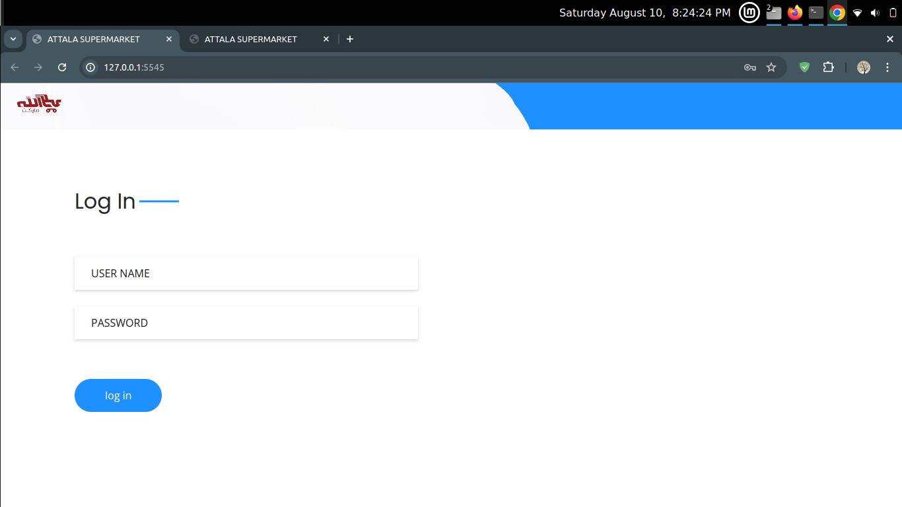

# Aid-distribution-management-system


## Overview

This project is a web application built with Flask that interacts with an Excel file and an SQLite database. The application performs various tasks such as reading data from the Excel file, updating the database, and managing user sessions.



## Features

- Read data from an Excel file.
- Manage user sessions with Flask.
- Store and retrieve data using SQLite.
- Admin user management.

## Installation

1. Clone the repository:
    ```bash
    git clone https://github.com/majdabualnour/Aid-distribution-management-system
    ```

2. Navigate to the project directory:
    ```bash
    cd Aid-distribution-management-system
    ```

3. Install the required dependencies:
- Python 3.x
- Flask
- SQLite3
- `openpyxl` library for handling Excel files

4. Run the application:
    ```bash
    python __init__.py
    ```

## Usage

### Running the Application

1. Start the Flask application:
    ```bash
    flask run
    ```

2. Access the application in your browser:
    ```
    http://127.0.0.1:5000
    ```

### Example Screenshots

Here are some example screenshots of the application in action:




## Contributing

If you want to contribute to this project, please follow these steps:

1. Fork the repository.
2. Create a new branch (`git checkout -b feature-branch`).
3. Make your changes.
4. Commit your changes (`git commit -am 'Add new feature'`).
5. Push to the branch (`git push origin feature-branch`).
6. Create a new Pull Request.

## License

This project is licensed under the MIT License - see the [LICENSE](LICENSE) file for details.

## Contact

For any questions or suggestions, please contact:

- **Majd Abualnour** - majdapoalnoor@gmail.com


